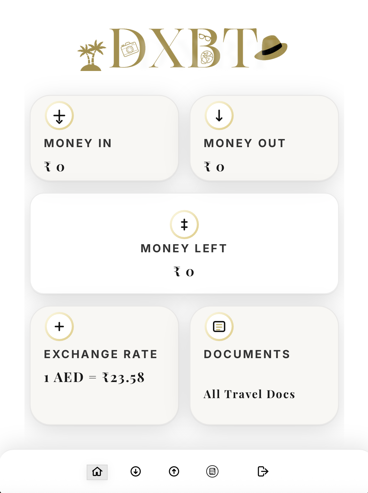

# DXBT - Dubai Travel Expense Tracker

<p align="center">
  
</p>

A comprehensive travel expense tracker and document manager specifically designed for travelers to Dubai. Keep track of your expenses, manage travel documents, and monitor your budget in one place.

## 🖥️ Screenshot

<p align="center">
  
  <br/>
  <em>DXBT Dashboard - Your all-in-one travel companion for Dubai</em>
</p>

## 🌟 Features

- 💰 **Expense Tracking**: Log and categorize your travel expenses
- 📊 **Visual Analytics**: Interactive charts for expense analysis
- 📁 **Document Management**: Securely store and access important travel documents
- 💱 **Currency Conversion**: Built-in currency converter with real-time rates
- 📱 **Responsive Design**: Works on desktop and mobile devices
- 🔒 **Secure**: Local data storage for privacy

## 🚀 Getting Started

### Prerequisites

- Node.js (v16 or later)
- npm or yarn

### Installation

1. Clone the repository:
   ```bash
   git clone https://github.com/vedang-patil-23/dxbt.git
   cd dxbt
   ```

2. Install dependencies:
   ```bash
   npm install
   # or
   yarn install
   ```

3. Start the development server:
   ```bash
   npm run dev
   # or
   yarn dev
   ```

4. Open [http://localhost:5173](http://localhost:5173) in your browser.

## 📂 Project Structure

```
src/
├── assets/          # Static assets (images, icons, etc.)
├── components/      # Reusable UI components
├── pages/           # Application pages
├── App.jsx         # Main application component
└── main.jsx        # Application entry point
```

## 🔧 Configuration

Create a `.env` file in the root directory with the following variables:

```env
VITE_APP_TITLE="DXBT - Dubai Travel Expense Tracker"
VITE_API_BASE_URL=your_api_base_url
# Add other environment variables as needed
```

## 📝 Usage

1. **Add Expenses**:
   - Click on "Money Out" to add new expenses
   - Categorize your expenses for better tracking
   
2. **Track Income**:
   - Log any income or money received during your trip
   
3. **View Analytics**:
   - Check the dashboard for expense breakdowns and visualizations
   
4. **Manage Documents**:
   - Store important travel documents like:
     - Passport copies
     - Visa documents
     - Hotel reservations
     - Flight tickets
     - Travel insurance
     - Emergency contacts
   - Documents are stored locally in your browser for privacy
   - For security, sensitive documents are not uploaded to any external server

### 📁 How to Add Documents

1. Click on the "Documents" tab in the navigation menu
2. Click the "Upload Document" button
3. Select the file from your device
4. Add a descriptive name and category (e.g., "Passport", "Visa", "Hotel")
5. Click "Save" to store the document

### 🔒 Document Storage Location
- Documents are stored in the `public/documents/` directory
- This directory is included in `.gitignore` for security
- For production, consider implementing secure cloud storage

### ⚠️ Important Notes
- Always keep backups of important documents
- The application uses local storage - documents will be lost if you clear browser data
- For sensitive documents, consider using encrypted storage

## 📱 Technologies Used

- React.js
- Vite
- React Router
- Chart.js (for visualizations)
- Tailwind CSS (for styling)
- React Icons

## 🤝 Contributing

Contributions are welcome! Please follow these steps:

1. Fork the repository
2. Create a new branch (`git checkout -b feature/AmazingFeature`)
3. Commit your changes (`git commit -m 'Add some AmazingFeature'`)
4. Push to the branch (`git push origin feature/AmazingFeature`)
5. Open a Pull Request

## 📄 License

This project is licensed under the MIT License - see the [LICENSE](LICENSE) file for details.

## 🙏 Acknowledgments

- Built with ❤️ by [Vedang Patil](https://github.com/vedang-patil-23) for personal use during my internship in Dubai (July 2025)
- Created to help manage travel expenses and documents while abroad
- Special thanks to all the open-source libraries that made this project possible
- If you find this useful for your own travels, feel free to star the repository!
